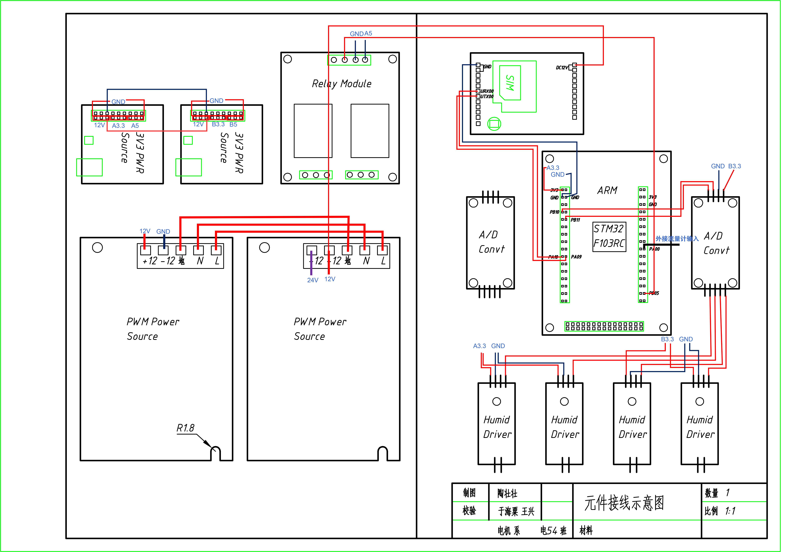

# 微灌溉硬件系统
## 1 概览

## 2 功能
功能名称|完成度|问题|日期
---|---|---|---|
iic|已修改，未调试||2018.4.6
PCF8591|已修改，未调试||2018.4.6
EMV|已修改，未调试||2018.4.6
data|已修改，未调试|流量计数器count在哪里操作的？|2018.4.6
battery|未修改|硬件问题，AD模块是否单独使用？|2018.4.6
verifier|未修改，之前没什么问题|～|～
SIM|未修改，之前没什么问题|～|～
timer|修改一些语法错误||2018.4.6
main||阀门异常检测？  流量计数count|2018.4.6

## 3 接线图

## 4 STM32技术手册
[stm32](datasheet stm32.pdf)